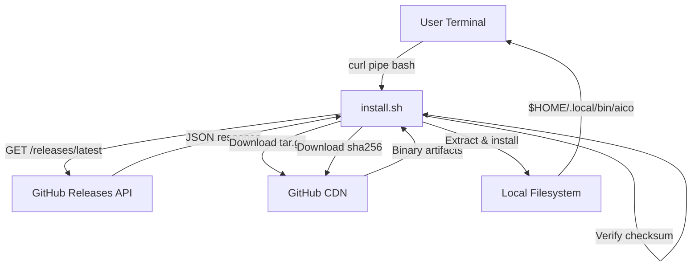
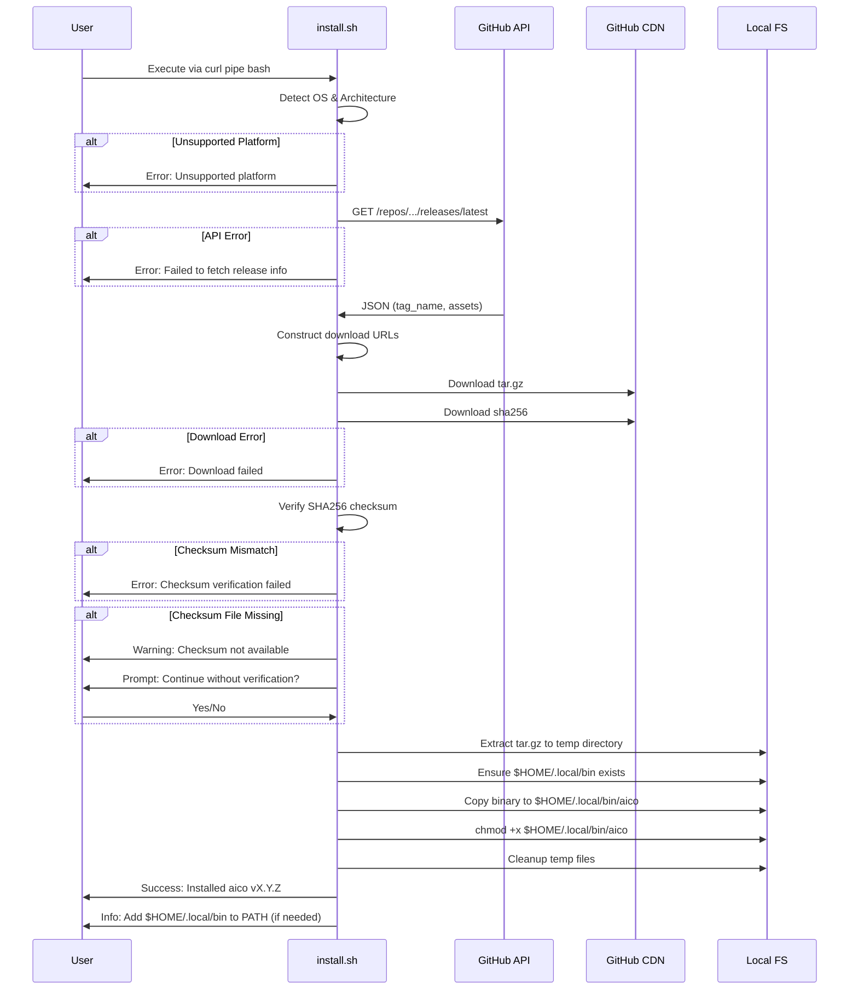
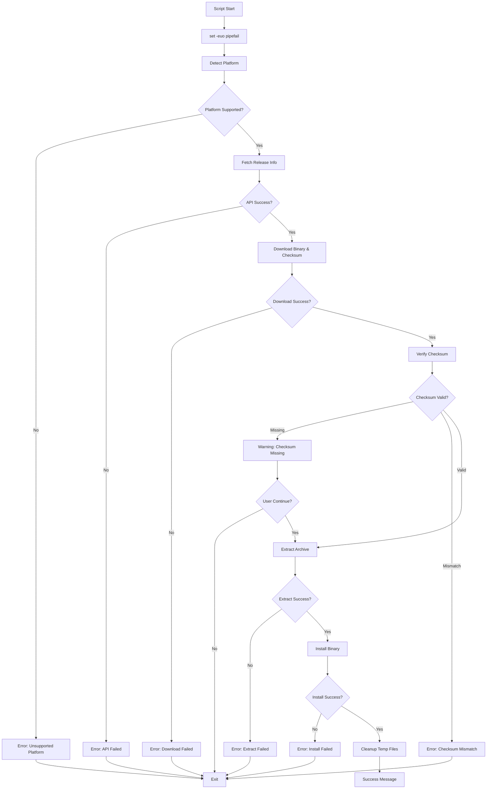
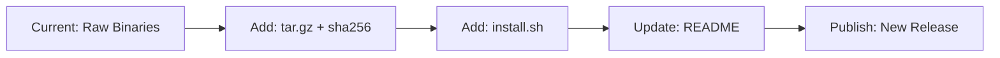

# Design Document

## Overview

AICO のプリビルドバイナリを GitHub Releases から自動的にダウンロードし、ユーザー環境にインストールするシェルスクリプトを提供します。このスクリプトは `curl | bash` パターンでの利用を想定し、プラットフォーム検出、バージョン取得、チェックサム検証、インストールまでを一連のフローで実行します。

**Purpose**: ユーザーが単一のコマンドで AICO の最新バイナリをインストールできる仕組みを提供し、手動ダウンロードや環境固有の設定作業を不要にします。

**Users**: CLI ツールを利用する開発者が、`curl -fsSL https://raw.githubusercontent.com/micheam/ai-assistant-console/main/install.sh | bash` コマンドで AICO をインストールします。

**Impact**: 現在は手動ダウンロードまたはビルドが必要なインストールプロセスを、ワンライナーで完結可能にします。

### Goals

- GitHub Releases から最新の安定版バイナリを自動取得
- macOS (Intel/Apple Silicon) および Linux (x86_64/arm64) のプラットフォーム自動検出
- SHA256 チェックサムによるバイナリ整合性検証
- `$HOME/.local/bin` へのユーザー権限インストール (sudo 不要)
- エラーハンドリングの徹底と進行状況の可視化

### Non-Goals

- Windows プラットフォームのサポート (将来の拡張として検討)
- Homebrew/apt/yum などのパッケージマネージャー統合 (別の機会で実装予定)
- 特定バージョンの指定インストール (最新版のみを対象)
- アンインストールスクリプトの提供 (手動削除で対応)

## Architecture

### Architecture Pattern & Boundary Map

単一の bash スクリプトとして実装し、外部依存は GitHub API と標準 Unix コマンド (`curl`, `tar`, `shasum`/`sha256sum`) のみです。複雑なアーキテクチャパターンは不要ですが、以下の責務分離を明確にします:



**Key Decisions**:
- スクリプトは冪等ではないが、既存バイナリの上書きをサポート
- ステップごとのエラーチェックで部分実行を防止
- 一時ファイルは `/tmp` 配下に作成し、終了時にクリーンアップ

**Architecture Integration**:
- Selected pattern: 単一スクリプトによる逐次実行モデル (複雑性が低いため状態管理不要)
- Domain/feature boundaries: インストールロジックはスクリプト内で完結し、AICO 本体との依存なし
- Existing patterns preserved: 既存のビルド/リリースパターンを維持し、スクリプトはリリース成果物を消費するのみ
- New components rationale: インストールスクリプトは独立した配布メカニズムとして機能
- Steering compliance: XDG Base Directory 準拠 (`$HOME/.local/bin`) の原則を維持

### Technology Stack

| Layer | Choice / Version | Role in Feature | Notes |
|-------|------------------|-----------------|-------|
| Runtime / Shell | Bash 3.2+ | スクリプト実行環境 | macOS デフォルトの bash 3.2 との互換性を確保 |
| HTTP Client | curl (標準) | GitHub API アクセスとファイルダウンロード | `-fsSL` オプションでセキュアなダウンロード |
| Archive | tar (標準) | tar.gz 展開 | macOS/Linux 両方で標準搭載 |
| Checksum | shasum (macOS) / sha256sum (Linux) | SHA256 検証 | OS ごとにコマンドを切り替え |
| Infrastructure | GitHub Releases | バイナリ配布基盤 | API とアセット CDN を使用 |

## System Flows

### Installation Flow



**Key Decisions**:
- チェックサムファイルが存在しない場合は警告を表示し、ユーザー確認で続行可能
- エラーは標準エラー出力に出力し、非ゼロ終了コードで終了
- 一時ディレクトリは `mktemp -d` で作成し、`trap` で確実にクリーンアップ

## Requirements Traceability

| Requirement | Summary | Components | Interfaces | Flows |
|-------------|---------|------------|------------|-------|
| 1 | プラットフォーム検出とバイナリダウンロード | Platform Detector, Download Manager | `uname -s`, `uname -m`, `curl -fsSL` | Installation Flow: Detect OS & Architecture |
| 2 | GitHub Releases からの最新バージョン取得 | Release Info Fetcher | GitHub Releases API (`/releases/latest`) | Installation Flow: Fetch release info |
| 3 | バイナリの展開とインストール | Archive Extractor, Binary Installer | `tar -xzf`, `mkdir -p`, `cp`, `chmod +x` | Installation Flow: Extract & Install |
| 4 | エラーハンドリングと情報表示 | Error Handler, Progress Logger | `echo`, `set -euo pipefail` | Installation Flow: Error handling at each step |
| 5 | 既存インストールの上書き | Binary Installer | `cp` (overwrite) | Installation Flow: Copy to $HOME/.local/bin |
| 6 | セキュリティと検証 | Checksum Verifier, Secure Downloader | `curl -fsSL`, `shasum -a 256 -c` / `sha256sum -c` | Installation Flow: Verify checksum |

## Components and Interfaces

すべてのコンポーネントは単一の bash スクリプト内に実装されますが、論理的な責務分離のために以下のように構成します。

| Component | Domain/Layer | Intent | Req Coverage | Key Dependencies (P0/P1) | Contracts |
|-----------|--------------|--------|--------------|--------------------------|-----------|
| Platform Detector | System | OS とアーキテクチャを検出 | 1 | uname (P0) | Function |
| Release Info Fetcher | External API | GitHub API から最新リリース情報を取得 | 2 | curl (P0), GitHub API (P0) | Function |
| Secure Downloader | Network | HTTPS 経由でファイルをダウンロード | 6 | curl (P0) | Function |
| Checksum Verifier | Security | SHA256 チェックサムを検証 | 6 | shasum/sha256sum (P1) | Function |
| Archive Extractor | File I/O | tar.gz を展開 | 3 | tar (P0) | Function |
| Binary Installer | File I/O | バイナリをインストールディレクトリにコピー | 3, 5 | mkdir, cp, chmod (P0) | Function |
| Error Handler | Logging | エラーメッセージの標準エラー出力 | 4 | echo (P0) | Function |
| Progress Logger | Logging | 進行状況の標準出力 | 4 | echo (P0) | Function |

### Core Logic

#### Platform Detector

| Field | Detail |
|-------|--------|
| Intent | OS とアーキテクチャを検出し、ダウンロード対象のバイナリ名を決定 |
| Requirements | 1 |

**Responsibilities & Constraints**
- `uname -s` で OS (Darwin/Linux) を検出
- `uname -m` でアーキテクチャ (x86_64/arm64/aarch64) を検出
- サポート対象外の OS/アーキテクチャの場合はエラーで終了

**Dependencies**
- Inbound: なし (スクリプト開始時に実行)
- Outbound: なし (変数に結果を格納)
- External: `uname` コマンド (P0 - システム標準コマンド)

**Contracts**: Service [ ] / API [ ] / Event [ ] / Batch [ ] / State [ ] ← Function [x]

##### Function Interface

```bash
detect_platform() {
  # Output: Sets global variables OS and ARCH
  # Returns: 0 on success, 1 on unsupported platform
}
```

- **Preconditions**: `uname` コマンドが存在する
- **Postconditions**: `OS` (darwin/linux) と `ARCH` (amd64/arm64) がグローバル変数に設定される
- **Invariants**: サポート対象のプラットフォームのみが設定される

**Implementation Notes**
- `uname -m` の出力を正規化 (x86_64 → amd64, aarch64 → arm64)
- サポート外の組み合わせの場合はエラーメッセージとサポート対象一覧を表示

---

#### Release Info Fetcher

| Field | Detail |
|-------|--------|
| Intent | GitHub Releases API から最新リリースのバージョン番号を取得 |
| Requirements | 2 |

**Responsibilities & Constraints**
- `https://api.github.com/repos/micheam/ai-assistant-console/releases/latest` からリリース情報を取得
- JSON レスポンスから `tag_name` フィールドを抽出 (例: `v1.2.3`)
- API エラー時 (HTTP 4xx/5xx) は終了

**Dependencies**
- Inbound: Platform Detector (OS/ARCH 情報を使用)
- Outbound: Secure Downloader (ダウンロード URL 構築)
- External: GitHub Releases API (P0), `curl` (P0), `jq` または `grep`/`sed` (P0)

**Contracts**: Service [ ] / API [x] / Event [ ] / Batch [ ] / State [ ]

##### API Contract

| Method | Endpoint | Request | Response | Errors |
|--------|----------|---------|----------|--------|
| GET | `https://api.github.com/repos/micheam/ai-assistant-console/releases/latest` | None | JSON (tag_name, assets) | 404 (Not Found), 403 (Rate Limit), 500 (Server Error) |

##### Function Interface

```bash
fetch_latest_version() {
  # Output: Prints version tag (e.g., v1.2.3) to stdout
  # Returns: 0 on success, 1 on API error
}
```

- **Preconditions**: `curl` が利用可能、ネットワーク接続が存在
- **Postconditions**: 最新のリリースバージョン番号がグローバル変数 `VERSION` に設定される
- **Invariants**: バージョン番号は `vX.Y.Z` 形式

**Implementation Notes**
- `jq` が利用可能な場合は `jq -r .tag_name` で抽出、なければ `grep`/`sed` でパース
- レート制限エラー (403) の場合は特別なメッセージを表示
- タイムアウトは 10 秒に設定 (`curl --max-time 10`)

---

#### Secure Downloader

| Field | Detail |
|-------|--------|
| Intent | HTTPS 経由でファイルを安全にダウンロード |
| Requirements | 6 |

**Responsibilities & Constraints**
- `curl -fsSL` オプションを使用してファイルをダウンロード
- HTTP エラー時 (4xx/5xx) は非ゼロ終了コード
- リダイレクトを自動的に追従

**Dependencies**
- Inbound: Release Info Fetcher (ダウンロード URL を受け取る)
- Outbound: Checksum Verifier, Archive Extractor (ダウンロードしたファイルを渡す)
- External: `curl` (P0), GitHub CDN (P0)

**Contracts**: Service [ ] / API [ ] / Event [ ] / Batch [ ] / State [ ] ← Function [x]

##### Function Interface

```bash
download_file() {
  local url="$1"
  local output="$2"
  # Returns: 0 on success, 1 on download error
}
```

- **Preconditions**: `curl` が利用可能、ネットワーク接続が存在、`output` パスが書き込み可能
- **Postconditions**: ファイルが `output` パスに保存される
- **Invariants**: HTTPS のみを使用 (HTTP へのフォールバックなし)

**Implementation Notes**
- `curl -fsSL -o "$output" "$url"` でダウンロード
- エラー時は HTTP ステータスコードを標準エラー出力に表示 (`curl -w "%{http_code}"`)

---

#### Checksum Verifier

| Field | Detail |
|-------|--------|
| Intent | SHA256 チェックサムを検証してバイナリの整合性を確認 |
| Requirements | 6 |

**Responsibilities & Constraints**
- チェックサムファイルをダウンロード (`aico_{os}_{arch}.tar.gz.sha256`)
- `shasum -a 256 -c` (macOS) または `sha256sum -c` (Linux) で検証
- チェックサムファイルが存在しない場合は警告を表示し、ユーザー確認

**Dependencies**
- Inbound: Secure Downloader (チェックサムファイルとバイナリ)
- Outbound: Archive Extractor (検証後にバイナリを渡す)
- External: `shasum` (macOS, P1), `sha256sum` (Linux, P1)

**Contracts**: Service [ ] / API [ ] / Event [ ] / Batch [ ] / State [ ] ← Function [x]

##### Function Interface

```bash
verify_checksum() {
  local binary_file="$1"
  local checksum_file="$2"
  # Returns: 0 on success, 1 on mismatch, 2 on checksum file missing
}
```

- **Preconditions**: `binary_file` と `checksum_file` が存在、チェックサムコマンド (`shasum` または `sha256sum`) が利用可能
- **Postconditions**: チェックサム一致時は正常終了、不一致時は非ゼロ終了
- **Invariants**: チェックサムファイル形式は `<hash> <filename>` (標準 SHA256SUM 形式)

**Implementation Notes**
- チェックサムコマンドが存在しない場合は警告を表示し、スキップオプション提供
- チェックサムファイルが 404 エラーの場合は「古いリリースまたは移行期間中」のメッセージを表示
- ユーザー確認プロンプト: `read -p "Continue without verification? (y/N): " response`

---

#### Archive Extractor

| Field | Detail |
|-------|--------|
| Intent | tar.gz ファイルを一時ディレクトリに展開 |
| Requirements | 3 |

**Responsibilities & Constraints**
- `tar -xzf` でアーカイブを展開
- 展開先は `mktemp -d` で作成した一時ディレクトリ
- 展開失敗時はエラーで終了

**Dependencies**
- Inbound: Checksum Verifier (検証済みバイナリ)
- Outbound: Binary Installer (展開されたバイナリファイルパス)
- External: `tar` (P0), `mktemp` (P0)

**Contracts**: Service [ ] / API [ ] / Event [ ] / Batch [ ] / State [ ] ← Function [x]

##### Function Interface

```bash
extract_archive() {
  local archive_file="$1"
  local extract_dir="$2"
  # Returns: 0 on success, 1 on extraction error
}
```

- **Preconditions**: `archive_file` が存在、`extract_dir` が書き込み可能
- **Postconditions**: バイナリファイル `aico` が `extract_dir` に展開される
- **Invariants**: アーカイブ内の構造は `aico` (単一バイナリ)

**Implementation Notes**
- `tar -xzf "$archive_file" -C "$extract_dir"` で展開
- アーカイブ内のファイル数を事前に確認 (`tar -tzf "$archive_file" | wc -l`) し、予期しない内容の場合は警告

---

#### Binary Installer

| Field | Detail |
|-------|--------|
| Intent | バイナリを `$HOME/.local/bin` にコピーし、実行権限を付与 |
| Requirements | 3, 5 |

**Responsibilities & Constraints**
- `$HOME/.local/bin` ディレクトリが存在しない場合は作成
- バイナリを `$HOME/.local/bin/aico` にコピー (既存ファイルを上書き)
- `chmod +x` で実行権限を付与

**Dependencies**
- Inbound: Archive Extractor (展開されたバイナリファイルパス)
- Outbound: Progress Logger (インストール完了メッセージ)
- External: `mkdir` (P0), `cp` (P0), `chmod` (P0)

**Contracts**: Service [ ] / API [ ] / Event [ ] / Batch [ ] / State [ ] ← Function [x]

##### Function Interface

```bash
install_binary() {
  local source_binary="$1"
  local install_dir="$HOME/.local/bin"
  # Returns: 0 on success, 1 on installation error
}
```

- **Preconditions**: `source_binary` が存在、`$HOME` が定義されている
- **Postconditions**: `$HOME/.local/bin/aico` が実行可能な状態で存在
- **Invariants**: インストール先は `$HOME/.local/bin/aico` (固定)

**Implementation Notes**
- 既存バイナリが存在する場合は `aico --version` で現在のバージョンを取得し、上書き前に表示
- コピー失敗時 (ディスク容量不足、権限エラー) は詳細なエラーメッセージを表示

---

#### Error Handler & Progress Logger

| Field | Detail |
|-------|--------|
| Intent | エラーメッセージと進行状況を適切な出力先に表示 |
| Requirements | 4 |

**Responsibilities & Constraints**
- エラーメッセージは標準エラー出力 (`>&2`)
- 進行状況メッセージは標準出力
- スクリプト開始時と完了時にバナーメッセージを表示

**Dependencies**
- Inbound: すべてのコンポーネントから呼び出される
- Outbound: なし
- External: `echo` (P0)

**Contracts**: Service [ ] / API [ ] / Event [ ] / Batch [ ] / State [ ] ← Function [x]

##### Function Interface

```bash
log_info() {
  local message="$1"
  echo "[INFO] $message"
}

log_error() {
  local message="$1"
  echo "[ERROR] $message" >&2
}

log_success() {
  local message="$1"
  echo "[SUCCESS] $message"
}
```

- **Preconditions**: なし
- **Postconditions**: メッセージが適切な出力先に表示される
- **Invariants**: エラーは常に標準エラー出力、それ以外は標準出力

**Implementation Notes**
- カラー出力はサポートしない (パイプ経由での実行を考慮)
- メッセージプレフィックス (`[INFO]`, `[ERROR]`, `[SUCCESS]`) で視認性を向上

## Error Handling

### Error Strategy

スクリプト冒頭で `set -euo pipefail` を設定し、以下のエラーハンドリング戦略を適用します:

- **Fail Fast**: コマンド失敗時は即座にスクリプトを終了
- **Explicit Error Messages**: エラー発生時は原因と対処方法を標準エラー出力に表示
- **Cleanup on Exit**: `trap 'cleanup' EXIT` で一時ファイルを確実にクリーンアップ

### Error Categories and Responses

**User Errors** (ユーザー環境起因):
- サポート外プラットフォーム → サポート対象一覧を表示し終了
- `curl` / `tar` コマンド未インストール → 必要なコマンドのインストール方法を案内
- ネットワーク接続エラー → ネットワーク状態の確認を促す

**System Errors** (外部サービス起因):
- GitHub API エラー (4xx/5xx) → HTTP ステータスコードと詳細メッセージを表示
- GitHub CDN ダウンロードエラー → リトライを促す、または手動ダウンロード URL を案内
- チェックサムファイル未提供 → 警告を表示し、ユーザー確認で続行可能

**Data Integrity Errors**:
- チェックサム不一致 → エラーメッセージを表示し終了、再実行を促す
- tar.gz 展開失敗 → アーカイブファイルの破損を示唆、再ダウンロードを促す

### Error Flow Visualization



### Monitoring

スクリプトはログファイルを生成しませんが、以下の情報を標準出力/標準エラー出力に出力します:

- **開始メッセージ**: インストール対象バージョンとプラットフォーム
- **進行状況**: 各ステップ (ダウンロード、検証、展開、インストール) の開始/完了
- **エラー詳細**: 失敗したコマンド、HTTP ステータスコード、ファイルパス
- **完了メッセージ**: インストールされたバージョン、バイナリパス、PATH 設定手順

## Testing Strategy

### Unit Tests (関数レベル)

シェルスクリプトの単体テストは [bats-core](https://github.com/bats-core/bats-core) を使用して実装します。

- `detect_platform()`: 各 OS/アーキテクチャの組み合わせをモックしてテスト
- `verify_checksum()`: 正常ケース、不一致ケース、チェックサムファイル欠落ケースをテスト
- `download_file()`: `curl` の成功/失敗をモックしてテスト (実際のネットワークアクセスなし)

### Integration Tests (エンドツーエンド)

- **成功フロー**: GitHub Releases の最新版をダウンロードし、実際にインストール
- **チェックサム検証**: 不正なチェックサムファイルを提供し、エラーで終了することを確認
- **プラットフォーム検出**: Docker コンテナで複数の OS/アーキテクチャをシミュレート

### Manual Tests (手動検証)

- **curl pipe bash**: `curl -fsSL <script_url> | bash` での実行
- **2ステップインストール**: スクリプトをダウンロード後に `bash install.sh` で実行
- **既存バイナリ上書き**: 既にインストール済みの環境で再実行し、上書きを確認
- **PATH 未設定環境**: `$HOME/.local/bin` が PATH に含まれない環境での動作確認

### Error Scenario Tests

- **ネットワーク切断**: ダウンロード中にネットワークを切断し、適切にエラー終了することを確認
- **GitHub API レート制限**: 大量リクエストでレート制限に達し、エラーメッセージを確認
- **サポート外プラットフォーム**: `uname` の出力をモックして Windows などをシミュレート

## Optional Sections

### Security Considerations

- **HTTPS 強制**: HTTP フォールバックを許可せず、HTTPS のみでダウンロード
- **チェックサム検証**: SHA256 チェックサムで Man-in-the-Middle 攻撃を検出
- **スクリプト透明性**: GitHub リポジトリで公開し、ユーザーが内容を確認可能
- **2ステップインストール推奨**: README でスクリプトダウンロード → 内容確認 → 実行の手順を明記
- **エラー時即座終了**: `set -euo pipefail` で部分実行を防止
- **一時ファイル管理**: `trap` で確実にクリーンアップし、機密情報の残留を防止

### Migration Strategy

既存のリリースワークフロー (`.github/workflows/release.yml`) を以下のように拡張します:

1. **tar.gz アーカイブ生成**: 各プラットフォームのバイナリを `aico_{os}_{arch}.tar.gz` 形式で圧縮
2. **SHA256 チェックサム生成**: `shasum -a 256 aico_{os}_{arch}.tar.gz > aico_{os}_{arch}.tar.gz.sha256` を実行
3. **GitHub Releases へのアップロード**: tar.gz と sha256 ファイルを両方アップロード
4. **インストールスクリプトの公開**: `install.sh` をリポジトリルートに配置し、`main` ブランチで公開
5. **README 更新**: インストール方法のセクションに `curl | bash` パターンと 2ステップ方法を追加

**移行フロー**:



**ロールバックトリガー**:
- リリースワークフローのビルドエラー
- チェックサム生成失敗
- インストールスクリプトの重大なバグ発見

**検証チェックポイント**:
- 各プラットフォームでインストールスクリプトが正常動作
- チェックサム検証が正しく機能
- 既存の手動インストール方法も引き続き利用可能
