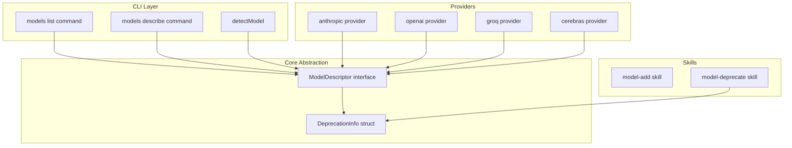
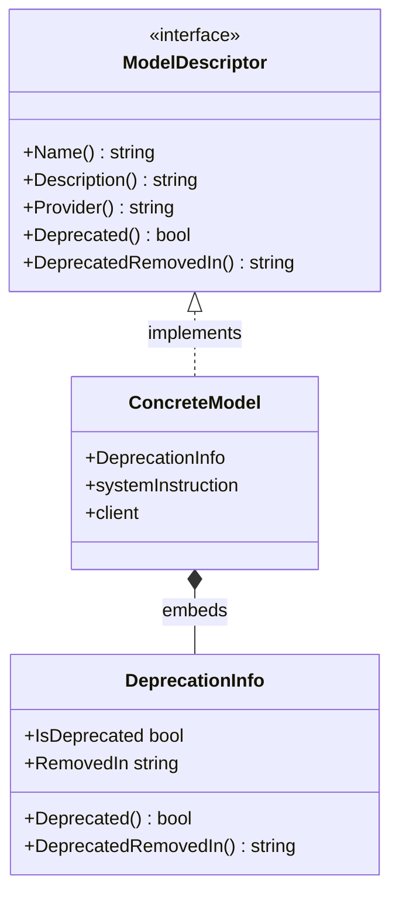

# Design Document: model-deprecation

## Overview

**Purpose**: プロバイダーごとのモデル非推奨管理を構造化されたメタデータとして実装し、CLI のモデル一覧・詳細表示・使用時の警告を通じてユーザーに適切な情報を提供する。

**Users**: aico CLI ユーザーおよび開発者（Claude Code スキル利用者を含む）。

**Impact**: `ModelDescriptor` インターフェースの拡張、全モデル実装への embedding 追加、CLI コマンドのフィルタリング・警告ロジック追加。

### Goals
- モデルの非推奨状態を型安全に管理する構造化メタデータの導入
- `models list` でのデフォルト非推奨フィルタリングと `--all` フラグによる全表示
- 非推奨モデル使用時の stderr 警告
- `/model-*` 命名規則によるスキル体系の統一

### Non-Goals
- 非推奨モデルの自動削除や使用ブロック
- バージョン文字列のセマンティックバリデーション
- プロバイダー側 API の非推奨ステータスとの同期

## Architecture

### Existing Architecture Analysis

現在のアーキテクチャ:
- `ModelDescriptor` インターフェース（`Name()`, `Description()`, `Provider()`）が全モデルの共通契約
- 各プロバイダーは `AvailableModels()` で `[]ModelDescriptor` を返す
- `cmd/aico/models.go` の `allAvailableModels()` が全プロバイダーのモデルを集約
- 非推奨は `Description()` 内のテキスト `[Deprecated]` プレフィックスでのみ表現

維持すべきパターン:
- インターフェース駆動のプロバイダー抽象化
- 1モデル1ファイルの構成
- プロバイダーの3つのファクトリ関数（`AvailableModels`, `NewGenerativeModel`, `DescribeModel`）

### Architecture Pattern & Boundary Map



**Architecture Integration**:
- Selected pattern: Embedding による既存インターフェースの拡張（`research.md` Option C）
- Domain boundaries: `assistant` パッケージに `DeprecationInfo` を配置、CLI 層でフィルタリング
- Existing patterns preserved: インターフェース駆動、1モデル1ファイル、ファクトリ関数
- Steering compliance: 最小限の外部依存、Go イディオム準拠

### Technology Stack

| Layer | Choice / Version | Role in Feature | Notes |
|-------|------------------|-----------------|-------|
| CLI | `github.com/urfave/cli/v3` | `--all` フラグ追加、警告出力 | 既存利用 |
| Core | Go 1.24 struct embedding | `DeprecationInfo` の全モデルへの適用 | 新規外部依存なし |

## Requirements Traceability

| Requirement | Summary | Components | Interfaces | Flows |
|-------------|---------|------------|------------|-------|
| 1.1, 1.2, 1.3, 1.4 | 非推奨メタデータ定義 | DeprecationInfo, ModelDescriptor | `Deprecated()`, `DeprecatedRemovedIn()` | — |
| 2.1, 2.2, 2.3 | 既存モデルへの適用 | 各プロバイダーのモデル構造体 | — | — |
| 3.1, 3.2, 3.3, 3.4, 3.5 | 一覧フィルタリング | listItemView, runListModels | `--all` フラグ | List Flow |
| 4.1, 4.2 | 詳細表示 | runDescribeModel | — | Describe Flow |
| 5.1, 5.2, 5.3 | 使用時の警告 | detectModel | — | Warning Flow |
| 6.1, 6.2, 6.3 | スキルリネーム | model-add SKILL.md | — | — |
| 7.1–7.7 | model-deprecate スキル | model-deprecate SKILL.md | — | — |

## Components and Interfaces

| Component | Domain/Layer | Intent | Req Coverage | Key Dependencies | Contracts |
|-----------|------------|--------|--------------|-----------------|-----------|
| DeprecationInfo | Core | 非推奨メタデータの保持 | 1.1–1.4 | なし | Service |
| ModelDescriptor | Core | インターフェース拡張 | 1.1–1.4 | DeprecationInfo (P0) | Service |
| Model structs | Provider | 各モデルの非推奨設定 | 2.1–2.3 | DeprecationInfo (P0) | — |
| listItemView | CLI | 一覧表示の拡張 | 3.1–3.5 | ModelDescriptor (P0) | State |
| runListModels | CLI | フィルタリングロジック | 3.1–3.5 | listItemView (P0) | — |
| runDescribeModel | CLI | 詳細表示の拡張 | 4.1–4.2 | ModelDescriptor (P0) | — |
| detectModel | CLI | 警告出力の追加 | 5.1–5.3 | ModelDescriptor (P0) | — |
| model-add skill | Skill | スキルリネーム | 6.1–6.3 | — | — |
| model-deprecate skill | Skill | 非推奨化スキル新規作成 | 7.1–7.7 | — | — |

### Core Abstraction Layer

#### DeprecationInfo

| Field | Detail |
|-------|--------|
| Intent | モデルの非推奨状態と削除予定バージョンを保持する embeddable 構造体 |
| Requirements | 1.1, 1.2, 1.3, 1.4 |

**Responsibilities & Constraints**
- 非推奨状態（bool）と削除予定バージョン（string）の2フィールドを保持
- ゼロ値で「非推奨でない」状態を表現（Go のゼロ値セマンティクス活用）
- `ModelDescriptor` インターフェースのメソッドを満たす

**Dependencies**
- なし（自己完結的な値型）

**Contracts**: Service [x]

##### Service Interface

```go
// DeprecationInfo はモデルの非推奨メタデータを保持する embeddable 構造体。
// ゼロ値は「非推奨でない」状態を表す。
type DeprecationInfo struct {
    IsDeprecated bool
    RemovedIn    string // semver バージョン文字列（例: "v2.0.0"）、未設定時は空文字列
}

func (d DeprecationInfo) Deprecated() bool           { return d.IsDeprecated }
func (d DeprecationInfo) DeprecatedRemovedIn() string { return d.RemovedIn }
```

- Preconditions: なし
- Postconditions: ゼロ値の `DeprecationInfo` は `Deprecated() == false`、`DeprecatedRemovedIn() == ""`
- Invariants: `IsDeprecated == false` の場合、`RemovedIn` は空文字列

#### ModelDescriptor（拡張）

| Field | Detail |
|-------|--------|
| Intent | 既存インターフェースに非推奨メソッドを追加 |
| Requirements | 1.1, 1.2 |

**Contracts**: Service [x]

##### Service Interface

```go
type ModelDescriptor interface {
    Name() string
    Description() string
    Provider() string
    Deprecated() bool              // 追加
    DeprecatedRemovedIn() string   // 追加
}
```

**Implementation Notes**
- 全モデル構造体は `DeprecationInfo` を embed することでこのインターフェースを満たす
- 既存の `GenerativeModel` は `ModelDescriptor` を embed しているため、自動的にメソッドが追加される

### Provider Layer

#### 各モデル構造体（一括変更）

| Field | Detail |
|-------|--------|
| Intent | 全モデル構造体に `DeprecationInfo` を embed し、非推奨モデルに値を設定 |
| Requirements | 2.1, 2.2, 2.3 |

**変更対象一覧**:

| Provider | Model | Deprecated | RemovedIn |
|----------|-------|------------|-----------|
| anthropic | ClaudeOpus4_6 | false | — |
| anthropic | ClaudeSonnet4_5 | false | — |
| anthropic | ClaudeOpus4_5 | true | TBD（ユーザー指定） |
| anthropic | ClaudeHaiku4_5 | false | — |
| openai | GPT52 | false | — |
| openai | GPT41 | false | — |
| openai | GPT41Mini | false | — |
| openai | O3 | false | — |
| openai | O4Mini | false | — |
| openai | O3Mini | false | — |
| openai | GPT4O | true | TBD |
| openai | GPT4OMini | true | TBD |
| openai | O1 | true | TBD |
| openai | O1Mini | true | TBD |
| groq | 全モデル | false | — |
| cerebras | 全モデル | false | — |

**Implementation Notes**
- 非推奨でないモデル: `assistant.DeprecationInfo` を embed するのみ（ゼロ値で自動的に `false`/`""` を返す）
- 非推奨モデル: `AvailableModels()` 内のインスタンス生成時に `DeprecationInfo` の値を設定
- 具体的な `RemovedIn` バージョンは実装時にユーザーと確認

### CLI Layer

#### listItemView（拡張）

| Field | Detail |
|-------|--------|
| Intent | モデル一覧表示ビューに非推奨情報を追加 |
| Requirements | 3.1, 3.2, 3.3, 3.4, 3.5 |

**Contracts**: State [x]

##### State Management

```go
type listItemView struct {
    Name               string `json:"name"`
    QualifiedName      string `json:"qualified_name"`
    Provider           string `json:"provider"`
    Description        string `json:"description"`
    Selected           bool   `json:"selected"`
    Deprecated         bool   `json:"deprecated,omitempty"`           // 追加
    DeprecatedRemovedIn string `json:"deprecated_removed_in,omitempty"` // 追加
}
```

- `String()` メソッド: `Deprecated == true` の場合、`qualifiedName [deprecated]` 形式で出力
- JSON 出力: `--all` 時のみ `deprecated`/`deprecated_removed_in` フィールドが非ゼロ値を含む

#### runListModels（拡張）

| Field | Detail |
|-------|--------|
| Intent | `--all` フラグに基づく非推奨モデルのフィルタリング |
| Requirements | 3.1, 3.2, 3.3, 3.4, 3.5 |

**変更内容**:
1. `--all` フラグ（`cli.BoolFlag`）の追加
2. `allAvailableModels()` からのモデル収集後、`--all` でない場合は `Deprecated() == true` のモデルを除外
3. `listItemView` に `Deprecated`/`DeprecatedRemovedIn` フィールドを設定

#### runDescribeModel（拡張）

| Field | Detail |
|-------|--------|
| Intent | 非推奨モデルの詳細表示に非推奨情報を追加 |
| Requirements | 4.1, 4.2 |

**変更内容**:
1. テキスト出力: `model.Deprecated() == true` の場合、`Deprecated:` と `Removed In:` 行を追加
2. JSON 出力: `deprecated` と `deprecated_removed_in` フィールドを追加

#### detectModel（拡張）

| Field | Detail |
|-------|--------|
| Intent | 非推奨モデル選択時の警告出力 |
| Requirements | 5.1, 5.2, 5.3 |

**変更内容**:
1. モデル解決後、`GenerativeModel` の `Deprecated()` を確認
2. `true` の場合、`fmt.Fprintf(os.Stderr, ...)` で警告メッセージを出力
3. 警告フォーマット: `Warning: model "%s" is deprecated and will be removed in %s. Consider switching to a newer model.\n`
4. 処理は中断せず、解決済みモデルをそのまま返却

### Skill Layer

#### model-add（リネーム）

| Field | Detail |
|-------|--------|
| Intent | 既存 `add-model` スキルを `model-add` にリネーム |
| Requirements | 6.1, 6.2, 6.3 |

**変更内容**:
1. `.claude/skills/add-model/SKILL.md` → `.claude/skills/model-add/SKILL.md` に移動
2. YAML front-matter の `name:` を `model-add` に更新
3. 本文のスキル名参照を更新
4. CLAUDE.md 内の `add-model` 参照を `model-add` に更新

#### model-deprecate（新規）

| Field | Detail |
|-------|--------|
| Intent | モデルを非推奨としてマークする Claude Code スキル |
| Requirements | 7.1, 7.2, 7.3, 7.4, 7.5, 7.6, 7.7 |

**スキル定義**:

```yaml
---
name: model-deprecate
description: Mark an existing model as deprecated. Sets structured deprecation metadata and removed-in version.
argument-hint: "[provider:model-id]"
---
```

**スキルの手順**:
1. 引数パース: `provider:model-id` 形式（`model-add` と同一ロジック）
2. 対象モデルのファイル特定: `internal/providers/<provider>/` 内の該当ファイル
3. ユーザーに `removed-in` バージョンを確認
4. モデル構造体の `DeprecationInfo` embed に値を設定
5. `Description()` に `[Deprecated]` プレフィックスを追加（未設定の場合）
6. プロバイダーファイルの doc comment を更新
7. ビルド・テスト実行
8. `models describe` で結果確認
9. Conventional Commits 形式でコミット

## Data Models

### Domain Model



**Invariants**:
- `IsDeprecated == false` → `RemovedIn == ""`
- `IsDeprecated == true` → `RemovedIn` は空文字列または有効なバージョン文字列

## Error Handling

### Error Strategy
- インターフェース違反はコンパイルエラーとして検出（`var _ ModelDescriptor = (*Struct)(nil)` パターン）
- 非推奨警告は stderr 出力のみで、処理フローに影響しない
- `--all` フラグの不正使用は `urfave/cli` が自動処理

## Testing Strategy

### Unit Tests
- `DeprecationInfo` のゼロ値テスト: `Deprecated() == false`、`DeprecatedRemovedIn() == ""`
- `DeprecationInfo` の設定値テスト: `IsDeprecated: true, RemovedIn: "v2.0.0"` の場合の返却値
- `listItemView.String()` の非推奨ラベル付き出力テスト
- 各プロバイダーの非推奨モデルが正しいメタデータを返すことのテスト

### Integration Tests
- `runListModels`: デフォルトで非推奨モデルが除外されることの確認
- `runListModels --all`: 全モデルが表示され、非推奨ラベルが付与されることの確認
- `runListModels --json --all`: JSON 出力に `deprecated` フィールドが含まれることの確認
- `runDescribeModel`: 非推奨モデルの詳細に非推奨情報が含まれることの確認
