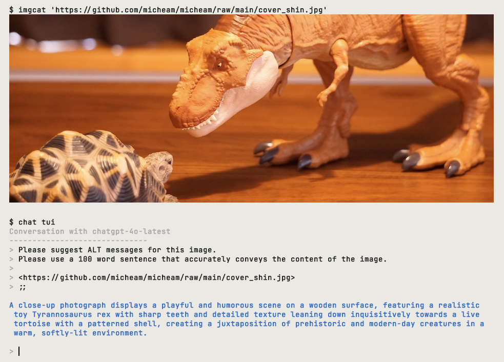

> [!WARNING]
> This project is still in development and is not ready for use.

# AICO - AI Assistant Console 



AICO is an AI-powered text generation tool using OpenAI's GPT-4 and other supported models.

## Install

Since pre-built binaries are not provided, you will need to install Go to build and run AICO.
Make sure you have _Go version 1.20 or higher_ installed on your system. 
You can check the installed version by running `go version`.

If you do not have Go installed or your version is outdated, download and install it from the [Go website](https://golang.org/dl/).

Once you have Go installed, follow these steps to install AICO:

1. Clone the repository:
   ```bash
   git clone https://github.com/micheam/ai-assistant-console.git
   ```
2. Navigate to the project directory:
   ```bash
   cd ai-assistant-console
   ```
3. Use the `go.mod` file to manage dependencies. You don't need to do anything manually since Go will handle this for you.
4. Build the executable binary by running `make`:
   ```bash
   make
   ```
   This will create a binary executable in the `bin/` directory.

Now, you can use commands as described in the [Usage](#usage) section.

## OpenAI API Key

Currently, AICO requires an OpenAI API key to use the GPT-4 API.
You can get an API key from [the OpenAI API Keys page].

Once you have an API key, you can set it in the `OPENAI_API_KEY` environment variable:

```bash
export OPENAI_API_KEY=<your API key>
```

## Usage of the `chat` Command

After building the binary, you can run `chat` to start chatting with AI.

```
NAME:
   chat - Chat with AI

USAGE:
   chat [global options] command [command options] [arguments...]

VERSION:
   0.0.11


COMMANDS:
   config   Show config file path
   tui      Chat with AI in TUI
   send     Send message to AI
   help, h  Shows a list of commands or help for one command

GLOBAL OPTIONS:
   --debug                    Enable debug mode (default: false) [$AICO_DEBUG]
   --model value, -m value    GPT model to use (default: "gpt-4")
   --persona value, -p value  Persona to use (default: "default")
   --help, -h                 show help
   --version, -v              print the version
```

### TUI Mode

To chat with AI in TUI mode, use the `tui` subcommand:

```bash
$ ./bin/chat tui
```

In TUI mode, you can send message with ';; (double semicolon)' line.

```bash
$ ./bin/chat tui
Conversation with gpt-4-1106-preview
------------------------------
> Translate into English:
> 
> こんにちは、世界。
> ;;

Hello, world.
```

You can input Image URL to get the description of the image.
(with `chatgpt-4o-latest` model)

```bash
$ chat --model=chatgpt-4o-latest tui
Conversation with chatgpt-4o-latest
------------------------------
> What is in this image?
> 
> <https://upload.wikimedia.org/wikipedia/commons/thumb/d/dd/Gfp-wisconsin-madison-the-nature-boardwalk.jpg/2560px-Gfp-wisconsin-madison-the-nature-boardwalk.jpg>
> ;;

This image shows a serene natural landscape with a wooden boardwalk path extending through a lush green
 field. The sky is bright and blue with scattered clouds, creating a peaceful and vibrant outdoor scene.
 Trees and bushes are visible in the background, adding to the natural beauty of the setting.
```

### Batch Mode

To send a message to AI, use the `send` subcommand:

```bash
$ ./bin/chat send "Translate into English: こんにちは、世界。"
Hello, world.
```

## Usage as a Vim Plugin

AICO can be used as a Vim plugin to generate text in Vim buffers.
Please see the [Vim plugin documentation](README.vim.md) for more information.

## Environment Variables

- `AICO_DEBUG`: Sets the debug mode of AICO. Default is `false`.

## Development

To contribute to AICO development, clone this repository and make the desired code changes.
Before submitting your changes, ensure the following:

- All tests pass by running `make test`
- The code formatting is consistent and adheres to [Go standards](https://golang.org/doc/effective_go)

## License
The AICO project is released under the [MIT License](LICENSE).


[the OpenAI API Keys page]: https://platform.openai.com/api-keys
